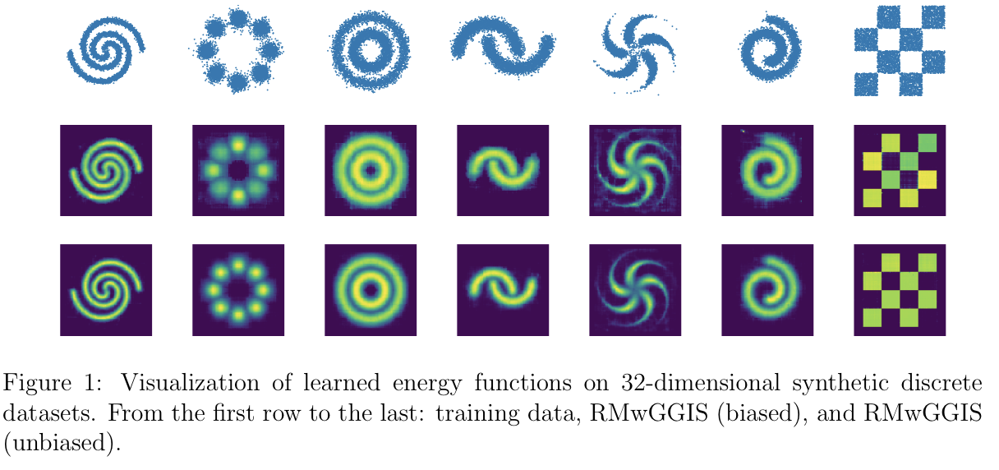

# RMwGGIS

The PyTorch (1.4.0) implementation of ["Gradient-Guided Importance Sampling for Learning Discrete Energy-Based Models"](https://openreview.net/forum?id=IEKL-OihqX0) (ICLR-2022, under review)

the official implementation is [here](https://github.com/divelab/RMwGGIS)

## Bio

In July this year, I gave a presentation of the energy-based models in our reading groups [slide](https://j-zin.github.io/files/ebm_slides.pdf). In the talk, I proposed a simple method to enhance ratio matching by introducing gradient relaxation. The experimental results on learning Boltzmann Machine seem quite good compared with original ratio matching. Recently, when I skimmed the submission papers on ICLR-2022, I found a paper, named GRADIENT-GUIDED IMPORTANCE SAMPLING FOR LEARNING DISCRETE ENERGY-BASED MODELS, which applies a similar method to reduce the time and space complexity of the ratio matching. Overall, the method is simple, but works well in discrete energy based model learning. I reproduce the experiment on synthetic data here. For more details, please refers to [this note](https://j-zin.github.io/files/gradient_guided_ratio_matching.pdf) and [the paper](https://openreview.net/forum?id=IEKL-OihqX0).

## Run

```bash
python main -data $dataset$
```

dataset = ['2spirals', '8gaussians', 'circles', 'moons', ...]

##  Results

<div align=center>

</div>


## Acknowledgement

The coding logic follows the project organization in [ALOE](https://github.com/google-research/google-research/tree/master/aloe).

